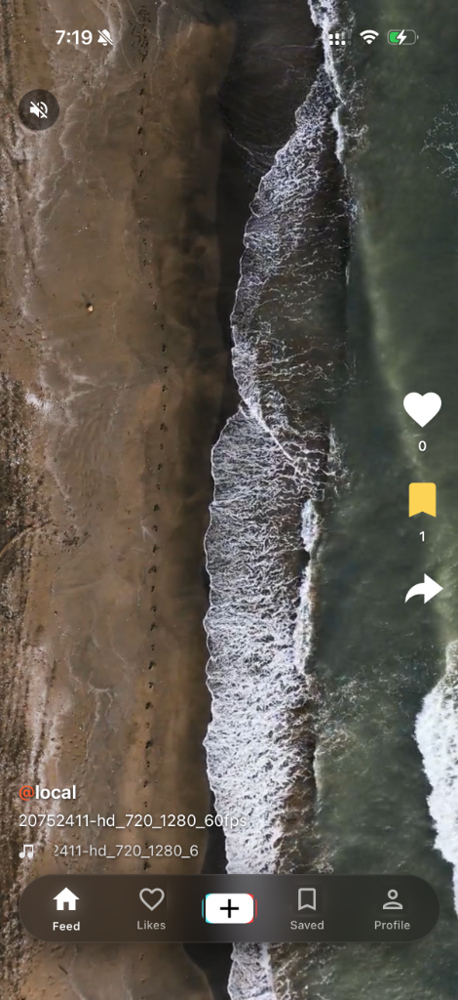
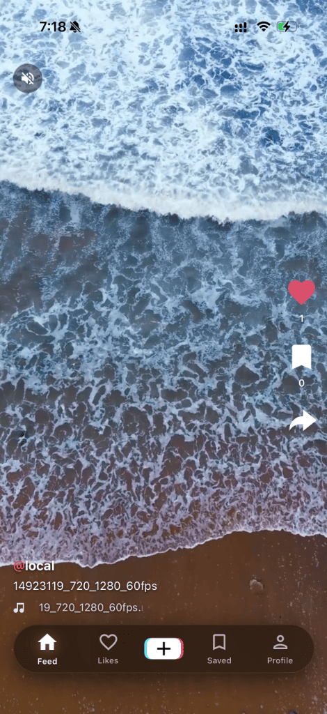
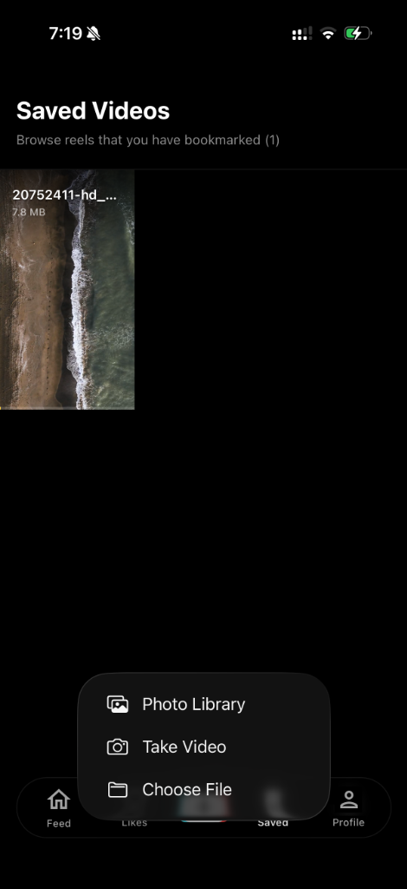
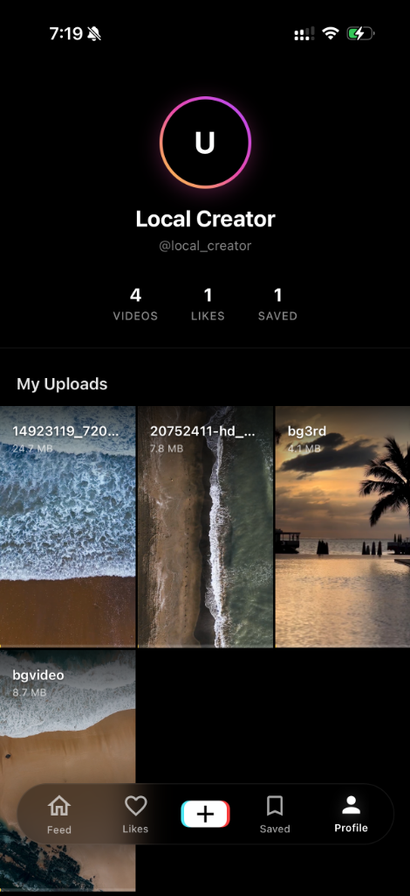

<p align="center">
  
</p>

<h1 align="center">VideoScroll 📱✨</h1>
<p align="center">
  <b>تطبيق ويب تقدمي (PWA) لتصفح مقاطع الفيديو القصيرة محلياً بالكامل شبيه بتيك توك وريلز</b><br>
  <b>A 100% Offline & Local TikTok / Instagram Reels Style Short-Video Scroller PWA</b>
</p>

<p align="center">
  <a href="https://osos3lom.github.io/videoscroll/" target="_blank"></a>
</p>

<p align="center">
  
  
  
  
  
</p>

<p align="center">
  <a href="https://osos3lom.github.io/videoscroll/"><b>🌐 التجربة الحية / Live Demo</b></a> •
  <a href="#-باللغة-العربية"><b>العربية</b></a> •
  <a href="#-in-english"><b>English</b></a> •
  <a href="#-لقطات-الشاشة--screenshots"><b>Screenshots</b></a> •
  <a href="#-هيكل-المشروع--project-structure"><b>Project Structure</b></a>
</p>

---

## 📸 لقطات الشاشة / Screenshots

<table align="center" width="100%">
  <tr>
    <td align="center" width="25%" valign="top">
      <b>🎬 تغذية الفيديو (الرئيسية)<br>Main Video Feed</b><br/><br/>
      
    </td>
    <td align="center" width="25%" valign="top">
      <b>❤️ التفاعل والإعجابات<br>Likes & Interaction</b><br/><br/>
      
    </td>
    <td align="center" width="25%" valign="top">
      <b>🔖 المحفوظات وخيارات الرفع<br>Saved & Upload Options</b><br/><br/>
      
    </td>
    <td align="center" width="25%" valign="top">
      <b>👤 الملف الشخصي للمنشئ<br>Creator Profile</b><br/><br/>
      
    </td>
  </tr>
</table>

---

<div id="-باللغة-العربية" dir="rtl" align="right">

# 🇸🇦 باللغة العربية

## 💡 عن المشروع
**VideoScroll** هو تطبيق ويب تقدمي متكامل (Progressive Web App - PWA) يمنحك تجربة تصفح غامرة لمقاطع الفيديو العمودية القصيرة (على غرار TikTok وInstagram Reels وYouTube Shorts)، ولكن بميزة استثنائية: **يعمل محلياً بنسبة 100% دون الحاجة إلى إنترنت، وبلا أي خدمات سحابية أو مفاتيح API خارجية.**

يقرأ التطبيق ملفات الفيديو المخزنة في جهازك مباشرة، ويتيح لك تشغيلها، والتنقل بينها بالسحب العمودي، وحفظ المقاطع المفضلة، وتسجيل الإعجابات، ورفع فيديوهات جديدة وحفظها على جهازك فوراً.

## 🌐 تجربة التطبيق الحية (Live Demo)
يمكنك استعراض تجربة حية للتطبيق مباشرة عبر متصفحك من خلال الرابط التالي:
👉 **[osos3lom.github.io/videoscroll](https://osos3lom.github.io/videoscroll/)**

---

## 🌟 أبرز المميزات
* **🚀 تصفح سلس وسريع (Smooth Snap Scroll):** دعم كامل لإيماءات السحب واللمس على الهواتف مع التمرير الذكي لملاءمة الشاشة.
* **🔒 خصوصية تامة وبدون إنترنت (Zero-Cloud / 100% Offline):** جميع بياناتك وفيديوهاتك تبقى داخل جهازك ولا تغادره أبداً.
* **❤️ نظام التفاعل والمحفوظات المحلي:** إمكانية إبداء الإعجاب وحفظ الفيديوهات (Bookmarks) مع تخزين دائم محلي في `data/social.json`.
* **📤 رفع مباشر من الجهاز:** دعم رفع مقاطع الفيديو من الاستوديو، الكاميرا المباشرة، أو متصفح الملفات وتخزينها فورياً في مجلد الفيديوهات.
* **👤 صفحة الملف الشخصي (Creator Profile):** استعراض إحصائيات منشئ المحتوى (عدد الفيديوهات، مجموع الإعجابات، المحفوظات) مع شبكة وسائط لجميع الفيديوهات المرفوعة.
* **📱 تثبيت كتطبيق هاتف (PWA):** مدعوم بمكتبة **Serwist** لتثبيت الموقع كتطبيق مستقل على أجهزة iPhone وAndroid وWindows والعمل في وضع عدم الاتصال.
* **⚡ بث فيديو تدريجي فائق الكفاءة:** دعم طلبات النطاق الجزئي (HTTP Range Requests) للتشغيل الفوري والتنقل السريع داخل الفيديو (Seeking) دون استهلاك غير ضروري للذاكرة.

---

## 🛠️ البنية البرمجية والتقنيات
| التقنية | الاستخدام |
| :--- | :--- |
| **Next.js 16 (App & Pages API)** | بناء الواجهات وإدارة الـ API المحلية لخدمة الوسائط |
| **React 19** | إدارة الحالة والتفاعل السريع مع واجهات المستخدم |
| **TypeScript** | توفير أمان الأنماط البرمجية وكتابة كود عالي الجودة |
| **Serwist / PWA** | إدارة عمال الخدمة (Service Workers) والتخزين المؤقت دون اتصال |
| **SWR (Stale-While-Revalidate)** | جلب البيانات وتحديث التفاعلات بسلاسة وفورية |
| **CSS Modules & Animate.css** | تصميم مخصص متجاوب بالكامل وتأثيرات حركية أنيقة |

---

## 🚀 البدء وطريقة التشغيل

### 1. استنساخ المشروع وتثبيت الاعتماديات
```bash
git clone https://github.com/osos3lom/videoscroll.git
cd videoscroll
npm install
```

### 2. إضافة مقاطع الفيديو
ضع ملفات الفيديو الخاصة بك داخل مجلد `videos/` الموجود في المجلد الرئيسي للمشروع:
```text
videos/
 ├── 01-intro.mp4
 ├── 02-beach.mp4
 └── clip.webm
```
> **💡 نصائح هامة للفيديوهات:**
> - صيغة **`.mp4`** (بترميز **H.264** وصوت **AAC**) هي الأكثر توافقاً مع جميع متصفحات الهواتف والكمبيوتر.
> - يفضل استخدام أبعاد طولية بنسبة **9:16** لأفضل مظهر.
> - يمكنك ترقيم أسماء الملفات مثل `01-` و `02-` للتحكم في ترتيب ظهورها في شريط التغذية.

### 3. تشغيل خادم التطوير
```bash
npm run dev
```
افتح المتصفح وتوجه إلى: **`http://localhost:3000`**

### 4. بناء نسخة الإنتاج (Production Build & PWA)
```bash
npm run build
npm run start
```

</div>

---

<div id="-in-english" dir="ltr" align="left">

# 🇬🇧 In English

## 💡 About The Project
**VideoScroll** is a modern, privacy-focused Progressive Web App (PWA) inspired by TikTok, Instagram Reels, and YouTube Shorts. It is architected to run **100% locally and offline on your machine or local network — with zero cloud lock-in, zero external API keys, and zero trackers.**

All videos are streamed directly from your local filesystem with full support for vertical gestures, instant playback, likes, bookmarking, profile stats, and direct file uploads.

## 🌐 Live Demo
You can view the live interactive preview of the application directly in your browser:
👉 **[osos3lom.github.io/videoscroll](https://osos3lom.github.io/videoscroll/)**

---

## 🌟 Key Features
* **🚀 Smooth Vertical Feed:** Native-like vertical snap scrolling with touch swipe gestures and autoplay-on-view.
* **🔒 100% Offline & Private:** No external network requests. Your media never leaves your hardware.
* **❤️ Local Social Engagement:** Instant like and save/bookmark features persisted locally in `data/social.json`.
* **📤 Direct Video Uploader:** Upload videos seamlessly via Photo Library, Camera capture, or File selector directly to your disk.
* **👤 Creator Profile Hub:** View real-time creator metrics (total videos, likes count, bookmarks) and an interactive gallery of all uploaded items.
* **📱 Progressive Web App (PWA):** Powered by **Serwist** service workers — install as a standalone native-feeling app on iOS, Android, macOS, and Windows.
* **⚡ Smart HTTP Range Streaming:** Chunked streaming for lightning-fast seeking, scrubbing, and zero buffering overhead.

---

## 🛠️ Tech Stack & Architecture
| Technology | Role |
| :--- | :--- |
| **Next.js 16** | Core framework, routing, and local media streaming endpoints |
| **React 19** | Component rendering and reactive state architecture |
| **TypeScript 5.9** | Strict type safety and predictable data structures |
| **Serwist (@serwist/next)** | Modern service worker compiler and offline caching strategies |
| **SWR** | Fast client-side cache and data revalidation |
| **CSS Modules & Animate.css** | Modern dark-mode UI with fluid mobile animations |

---

## 🚀 Getting Started

### 1. Clone & Install Dependencies
```bash
git clone https://github.com/osos3lom/videoscroll.git
cd videoscroll
npm install
```

### 2. Add Your Videos
Drop any video files into the root `videos/` folder:
```text
videos/
 ├── 01-nature.mp4
 ├── 02-city.mp4
 └── sample.mov
```
> **💡 Pro-tips for media:**
> - Standard **`.mp4`** (H.264 video codec + AAC audio) delivers the highest compatibility across mobile browsers.
> - Vertical (9:16 aspect ratio) videos provide the best visual experience.
> - Sort order follows filename alphanumeric order (prefixing with `01-`, `02-` is recommended).

### 3. Start Development Server
```bash
npm run dev
```
Open **`http://localhost:3000`** in your browser.

### 4. Build for Production & PWA
```bash
npm run build
npm run start
```

</div>

---

## 📂 هيكل المشروع / Project Structure

```text
videoscroll/
├── public/                  # Static assets, icons, manifest & screenshots
│   ├── icon-192x192.png     # PWA App Icon
│   ├── icon-256x256.png     # PWA High-res Icon
│   ├── icon-512x512.png     # Splash & Store Icon
│   ├── manifest.json        # Web App Manifest
│   └── screenshots/         # Documentation preview images
├── src/
│   ├── components/          # Reusable UI elements (Navbar, Footer, VideoCard, Upload, etc.)
│   ├── hooks/               # Custom hooks (useInViewPlayback, useSocialStorage)
│   ├── lib/                 # Local filesystem video helpers & resolvers
│   ├── pages/               # Application pages (Feed, Likes, Saved, Profile, API routes)
│   │   ├── api/             # Local streaming & chunked upload endpoints
│   │   ├── index.tsx        # Main full-screen video feed
│   │   ├── likes.tsx        # Liked videos gallery
│   │   ├── profile.tsx      # Creator statistics & uploads overview
│   │   └── saved.tsx        # Bookmarked videos
│   ├── styles/              # Global styling & animations
│   ├── sw.ts                # Serwist service worker definition
│   └── types/               # TypeScript interfaces & types
├── videos/                  # Local video storage directory (MP4, WebM, MOV)
├── data/                    # Local social database (social.json)
└── serwist.config.mjs       # PWA build configuration
```

---

## 📜 الأوامر المتاحة / Available Scripts

| الأمر / Command | الوصف / Description |
| :--- | :--- |
| `npm run dev` | تشغيل خادم التطوير السريع / Start Next.js development server |
| `npm run build` | بناء المشروع وتوليد ملفات PWA / Build Next.js & compile Serwist PWA |
| `npm run start` | تشغيل نسخة الإنتاج / Start the production server |
| `npm run lint` | فحص جودة الأكواد / Run ESLint check |
| `npm run typecheck` | التحقق من صحة الأنواع / Run TypeScript type-checker |

---

<p align="center">
  Made with ❤️ by <a href="https://github.com/osos3lom"><b>osos3lom</b></a>
</p>
